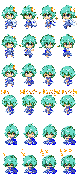
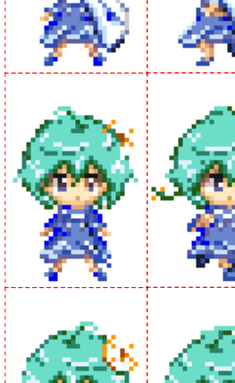
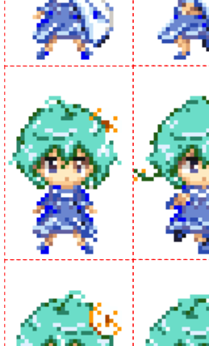
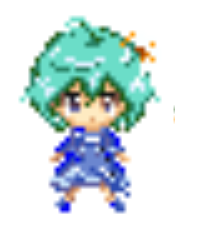

# 素材の推奨仕様

##  これは

Akashicのゲーム中で、アセットとして用いる素材に関する推奨仕様をまとめます。

##  推奨仕様

素材の **推奨仕様** とは、Akashic がゲーム開発者に推奨する素材の仕様です。

要求仕様(ここでは触れません)と異なり、ゲーム開発者は必ずしも推奨仕様に従う必要はありません。
推奨仕様は、多くのゲーム開発者にとってより意図に近い・望ましいであろう動作を実現するための一種のガイドラインであり、
従わない場合でもゲームは動作します。

###  一つの画像ファイル中の複数の画像は間隔を空ける

Akashic のゲームでは、複数の画像を一つの画像ファイルにまとめたもの(並べたもの)を扱うことがあります。

典型的な例は、スプライト(`g.Sprite`)に用いる画像(`g.SpriteParameterObject#src`)です。
スプライトは与えられた画像の一部だけを表示することができ、また表示内容を同じ画像の別の部分に容易に切り替えられます。
この機能のため、スプライトに用いる画像ファイルは、以下のような複数の内容を一つにまとめたものになる場合があります。

この時、ファイル中の各画像の境界部分には1ピクセル以上の間隔を設けることが推奨されます。
すなわち画像同士の境界に接する各ピクセルは、透明色であるべきです。

例えば次の画像は、上の画像の一部を拡大したものです。

ここで赤の点線は境界を示すための仮想的なものです。
この例では、各画像の境界部分(赤の点線)に接するピクセルはすべて透明色になっています。
他方、この画像全体を左に1ピクセルずらしたものが次の画像です。
境界として取り扱う範囲を変えない場合、境界に接している不透明色のピクセルが二つ存在することがわかります。

この画像は推奨仕様に従っていません。

#### 推奨の理由

この推奨に従わない場合、画像の拡大・縮小描画の際に隣接する不透明色が「滲む」ことがあります。
以下はある環境において、前述の「推奨仕様に従ってない画像」に示した一部分を、5倍に拡大して描画する `g.Sprite` を表示したものです。

キャラクタの右側に滲んだ不透明色が確認できます。

ビットマップフォント(`g.BitmapFont`)として使う画像や、タイル(`@akashic-extension/akashic-tile`)に与えるマップチップ画像(`g.TileParameterObject#src`)などにも同様の注意が必要です。
特にタイルは、その性質上間隔を空けずに使うことが多いと考えられます。従ってタイルの拡大縮小は推奨されません。

