# CompositeOperationの利用

## <a name="これは"></a> これは

`E#compositeOpration` の利用方法を記述したドキュメントです。
対象バージョンはakashic-engine@1.1.6以降です。

## <a name="compositeOperationとは"></a> compositeOperationとは

`E#compositeOperation` とは、エンティティを描画する際の合成方法を指定するプロパティです。

以下の値を指定可能です。

- `CompositeOpration.SourceOver`
- `CompositeOpration.SourceAtop`
- `CompositeOpration.Lighter`
- `CompositeOpration.Copy`
- `CompositeOpration.ExperimentalSourceIn`
- `CompositeOpration.ExperimentalSourceOut`
- `CompositeOpration.ExperimentalDestinationAtop`
- `CompositeOpration.ExperimentalDestinationIn`
- `CompositeOpration.DestinationOut`
- `CompositeOpration.DestinationOver`
- `CompositeOpration.Xor`
- 未指定（`undefined`）

## <a name="SourceOver"></a> SouceOver

先に描画された領域の上に重ねて描画します。これがデフォルトの合成方法となります。

以下は、緑色、赤色、青色の `FilledRect` を重ねて描画する例です。

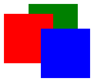

```javascript
var green = new g.FilledRect({scene: scene, x: 50, width: 100, height: 100, cssColor: "green"});
green.compositeOperation = g.CompositeOperation.SourceOver;
var red = new g.FilledRect({scene: scene, y: 20, width: 100, height: 100, cssColor: "red"});
red.compositeOperation = g.CompositeOperation.SourceOver;
var blue = new g.FilledRect({scene: scene, x: 75, y: 50, width: 100, height: 100, cssColor: "blue"});
blue.compositeOperation = g.CompositeOperation.SourceOver;
scene.append(green);
scene.append(red);
scene.append(blue);
```

## <a name="SourceAtop"></a> SourceAtop

先に描画された領域と重なった部分のみを描画します。

以下の例では、赤色と青色の `FilledRect` に `SourceAtop` 指定し、緑色の `FilledRect` と重なった部分だけ描画する例です。

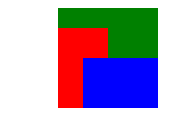


```javascript
red.compositeOperation = g.CompositeOperation.SourceAtop;
blue.compositeOperation = g.CompositeOperation.SourceAtop;
```

## <a name="Lighter"></a> Lighter

先に描画された領域と重なった部分の色を加算して描画します。

以下の例では、赤色と青色の `FilledRect` に `Lighter` 指定したものです。

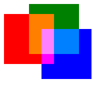


```javascript
red.compositeOperation = g.CompositeOperation.Lighter;
blue.compositeOperation = g.CompositeOperation.Lighter;
```


## <a name="Copy"></a> Copy

先に描画された領域の状態に関わらず、全て上書きして描画します。
描画内容が透明な場合、描画先の内容にかかわらず透明な画像が上書き描画されます。

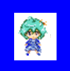

```javascript
blue.compositeOperation = g.CompositeOperation.SourceOver;
character.compositeOperation = g.CompositeOperation.Copy;
```


## <a name="ExperimentalSourceIn"></a> ExperimentalSourceIn

 先に描画された領域と重なった部分に描画を行い、それ以外の部分を透明にします。

 以下の例では、赤色の `FilledRect` に `ExperimentalSourceIn` を指定し、描画先となる青色の `FilledRect` と重なった部分だけ描画する例です。

 環境により、描画結果が大きく異なる可能性があるため、試験的導入となります。

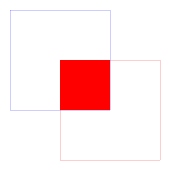

```javascript
red.compositeOperation = g.CompositeOperation.ExperimentalSourceIn;
```


## <a name="ExperimentalSourceOut"></a> ExperimentalSourceOut

先に描画された領域と重なっていない部分に描画を行い、それ以外の部分を透明にします。

以下の例では、赤色の `FilledRect` に `ExperimentalSourceOut` を指定し、描画先となる青色の `FilledRect` と重なっていない部分を描画する例です。

環境により、描画結果が大きく異なる可能性があるため、試験的導入となります。

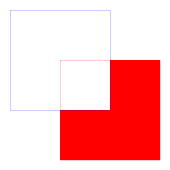

```javascript
red.compositeOperation = g.CompositeOperation.ExperimentalSourceOut;
```


## <a name="ExperimentalDestinationAtop"></a> ExperimentalDestinationAtop

描画する領域だけを表示し、先に描画された領域と重なった部分は描画先を表示します。

以下の例では、赤色の `FilledRect` に `ExperimentalDestinationAtop` を指定し、描画先となる青色の `FilledRect` と重なった部分は青色を表示する例です。

環境により、描画結果が大きく異なる可能性があるため、試験的導入となります。

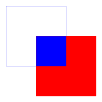

```javascript
red.compositeOperation = g.CompositeOperation.ExperimentalDestinationAtop;
```


## <a name="ExperimentalDestinationIn"></a> ExperimentalDestinationIn

先に描画された領域と重なった部分に描画を行い、それ以外の部分を透明にします。

以下の例では、赤色の `FilledRect` に `ExperimentalDestinationIn` を指定し、描画先となる青色の `FilledRect` と重なった部分は青色を表示し、それ以外の部分を透明にする例です。

環境により、描画結果が大きく異なる可能性があるため、試験的導入となります。

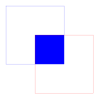

```javascript
red.compositeOperation = g.CompositeOperation.ExperimentalDestinationIn;
```


## <a name="DestinationOut"></a> DestinationOut

描画する領域を透明にします。

以下の例では、赤色の `FilledRect` に `DestinationOut` を指定し、描画する領域を透明にする例です。

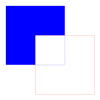

```javascript
red.compositeOperation = g.CompositeOperation.DestinationOut;
```


## <a name="DestinationOver"></a> DestinationOver

先に描画された領域の下に描画します。

以下の例では、赤色の `FilledRect` に `DestinationOver` を指定し、描画先となる青色の `FilledRect` の下に描画する例です。

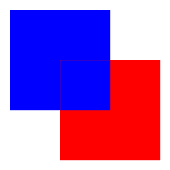

```javascript
red.compositeOperation = g.CompositeOperation.DestinationOver;
```


## <a name="Xor"></a> Xor

先に描画された領域と重なった部分のみ透明にします。

以下の例では、赤色の `FilledRect` に `Xor` を指定し、描画先となる青色の `FilledRect` と重なった部分のみ透明にする例です。

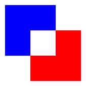

```javascript
red.compositeOperation = g.CompositeOperation.Xor;
```


## <a name="未指定（undefined）"></a> 未指定（undefined）

`E#compositeOperation` はデフォルトで未指定（ `undefined` ）ですが、この時の合成方法は親エンティティの `compositeOperation` によって変わってきます。

* 親エンティティの `compositeOperation` が未指定（ `undefined` )

  デフォルトの合成方法である `SourceOver` で合成されます。

* 親エンティティの `compositeOperation` が指定されている

  親エンティティの `compositeOperation` で合成されます。


## <a name="Paneの利用"></a> Paneの利用

`SourceAtop` や `Lighter` を利用する際に、`Pane` を利用することで、先に描画された領域を合成対象に含めないようにすることが出来ます。

例えば、以下のように背景（灰色の `FilledRect`）が存在する場合に、`SourceAtop` を使って赤色と青色の `FilledRect` のうち、緑色の `FilledRect` と重なる部分のみを描画したいケースを考えます。

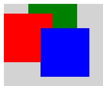

```javascript
var bg = new g.FilledRect({scene: scene, width: game.width, height: game.height, cssColor: "lightgray"});
scene.append(bg);
var green = new g.FilledRect({scene: scene, x: 50, width: 100, height: 100, cssColor: "green"});
var red = new g.FilledRect({scene: scene, y: 20, width: 100, height: 100, cssColor: "red"});
var blue = new g.FilledRect({scene: scene, x: 75, y: 50, width: 100, height: 100, cssColor: "blue"});
scene.append(green);
scene.append(red);
scene.append(blue);
```
単純に、

```
red.compositeOperation = g.CompositeOperation.SourceOver;
blue.compositeOperation = g.CompositeOperation.SourceOver;
```

としても、合成対象に背景が含まれてしまうので、赤色と青色の `FilledRect` はそのまま描画されます。

このような場合に `Pane` を利用します。

`Pane` は内部に描画キャッシュを持ち、 子エンティティは描画キャッシュに描画されます。

つまり、 `Pane` の子エンティティの合成対象に `Pane` 外のエンティティは含まれなくなります。

以下の例では、緑色、赤色、青色の `FilledRect` を `Pane` に追加しています。

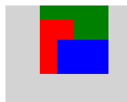

```javascript
var bg = new g.FilledRect({scene: scene, width: game.width, height: game.height, cssColor: "lightgray"});
var green = new g.FilledRect({scene: scene, x: 50, width: 100, height: 100, cssColor: "green"});
var red = new g.FilledRect({scene: scene, y: 20, width: 100, height: 100, cssColor: "red"});
red.compositeOperation = g.CompositeOperation.SourceAtop;
var blue = new g.FilledRect({scene: scene, x: 75, y: 50, width: 100, height: 100, cssColor: "blue"});
blue.compositeOperation = g.CompositeOperation.SourceAtop;
var pane = new g.Pane({scene: scene, width: 175, height: 150});
pane.append(green);
pane.append(red);
pane.append(blue);
scene.append(bg);
scene.append(pane);
```
