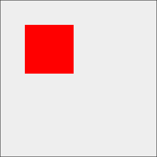
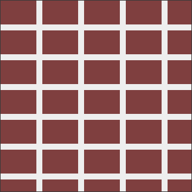
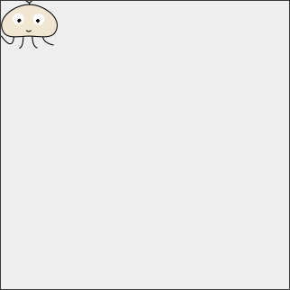
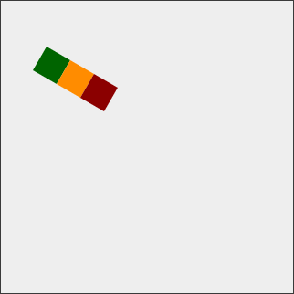
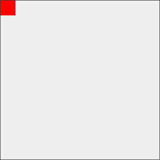
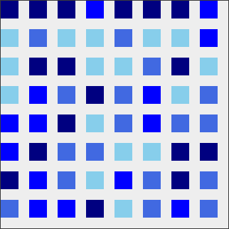
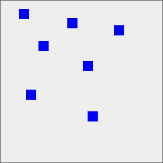
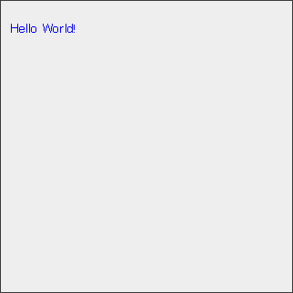
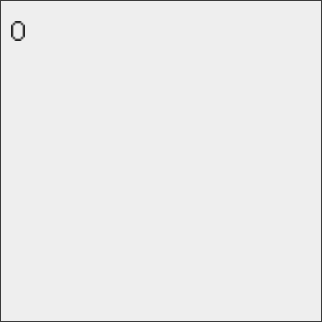
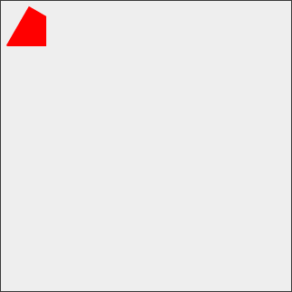

# Akashic Engine 入門

## はじめに

Akashic Engine は JavaScript で動作するゲームエンジンです。
Akashic Engine を利用することでマルチプラットフォームで動作するゲームを開発できます。
Akashic Engine はオープンソースで開発されているフリーソフトウェアです。
作成したゲームの公開にロイヤリティは必要ありません。
Akashic Engine にはゲーム開発で利用できるツールとライブラリが用意されており、
今すぐゲーム開発を始めることができます。

> * Akashic Engine の現在の実装は2D描画を主体とするゲームに特化しています。

## 開発に必要なもの

Akashic Engine のゲーム開発には基本的なプログラミングの知識が必要です。
Akashic Engine は JavaScript や TypeScript を利用してゲームのコードを書きます。
このチュートリアルでは JavaScript を利用します。
チュートリアルでは JavaScript の細かな機能や文法については解説していません。
JavaScript に初めて触れる方や、知識に不安のある方は、
適宜インターネット上の解説記事や入門書を参照してください。

チュートリアルで説明している内容を試すには、
コンピュータ (Windows, Mac, Linuxなど) とインターネット接続環境が必要です。
Akashic Engine を利用したゲーム開発にはプログラミング作業が必要になり、
その過程で次のような操作を行う必要があります。

* テキストエディタを利用してソースファイルを作成する。
* CUIウインドウを利用してコマンドを実行する。
* 開発に必要なプログラムをインターネットからダウンロードしてインストールする。

これらの操作は利用しているコンピュータの種類や
バージョンによって異なる場合があります。
インターネットで検索してもやり方が分からない場合は、
詳しい人に相談してください。

## 開発環境の構築

### Node.js のインストール

Akashic Engine のゲーム開発には Node.js が必要です。
Node.js は JavaScript のプログラムの実行と開発に必要なツールを
まとめたソフトウェアです。
Node.js には `node` コマンドと `npm` コマンドが付属します。
`node` コマンドは JavaScript のプログラムを動かすコマンドです。
Akashic Engine のツールは JavaScript で開発されており、
実行に `node` コマンドを利用します。
`npm` コマンドは JavaScript に関連するツールやライブラリを簡単に導入するコマンドです。
Akashic Engine 本体も `npm` コマンドでダウンロードとインストールを行います。

Node.js をインストールする方法はいくつかありますが、
[公式サイト](https://nodejs.org/ja/)に用意されている
インストーラを利用するのが簡単です。
Node.js には最新の機能を利用できる最新版と、
長期間利用可能な LTS 版(推奨版)があります。
Akashic Engine はどちらのバージョンでも動作しますが、
このチュートリアルは LTS 版を前提に説明を進めます。

Node.js はコマンドプロンプト (Windows) やターミナル (Mac) などの
端末エミュレータにコマンドを入力して操作します。
コマンドを入力するウインドウのことを、このチュートリアルでは CUI ウインドウとよびます。
インストールが正常に行われたかどうかを確認するために、
CUI ウインドウに次のコマンドを入力してください。

```sh
node -v
```

このコマンドは Node.js のバージョンを画面に出力します。
正常にインストールされていれば次のようにバージョン番号が表示されます。

```sh
v4.5.0
```

`v4.5.0` は執筆時点での LTS 版のバージョンです。
新しいバージョンがリリースされるとこの数字は大きくなります。

### Akashic Engine のインストール

Akashic Engine のインストールには `npm` コマンドを利用します。
`npm` コマンドを利用すると `npm install -g <パッケージ名>` でツールやライブラリをインストールできます。
Akashic Engine のゲーム開発には次の2つのパッケージが必要です。

* `@akashic/akashic-cli`
* `@akashic/akashic-sandbox`

登録ができたら次のコマンドで必要なツールをインストールします。

```
npm install -g @akashic/akashic-cli
npm install -g @akashic/akashic-sandbox
```

インストールが完了すると、`akashic` コマンドと `akashic-sandbox` コマンドを利用できるようになります。
以下のコマンドでそれぞれのコマンドのバージョンを表示することができます。
エラーが表示されるバージョンが表示できれば、インストールが正常に行われています。

```sh
akashic -V
akashic-sandbox -V
```

執筆時点では `akashic` のバージョンとして `1.0.0`、
`akashic-sandbox` のバージョンとして `0.8.0` が表示されます。

## 空のゲームの作成

Akashic Engine のゲームには設定ファイル (`game.json`) と、
ゲームを起動するプログラムが必要です。
`game.json` はゲームの設定とゲームが利用するアセットを記述する JSON 形式のファイルです。
アセットはプログラムのソースコードや画像、音声ファイルなどゲームの実行に必要なファイルのことです。

以下は `game.json` の例です。

```json
{
  "width": 320,
  "height": 320,
  "fps": 30,
  "main": "./main.js",
  "assets": {
    "main": {
      "type": "script",
      "path": "main.js",
      "global": true
    }
  }
}
```

ここで指定している `main.js` がゲームが最初に読み込むプログラムです。
`assets.main` プロパティで、`main.js` がスクリプトアセットであること、
`main` プロパティで最初に読み込むスクリプトであることを表しています。

`main.js` は最初のシーンを作成します。
シーンはゲームの場面を表すオブジェクトです。
例えば、タイトル場面、プレイ場面、スコア場面など必要に応じて作成できます。
Akashic Engine のゲームには最低1つのシーンが必要です。
次のプログラムは空のシーンを作成して、そのシーンを表示します。

```javascript
function main() {
  var scene = new g.Scene({game: g.game});
  g.game.pushScene(scene);
}

module.exports = main;
```

上のコードを `main.js` という名前で保存します。
作成したゲームを動かすには、`game.json` と `main.js` を同じディレクトリに配置し、
そのディレクトリで次のコマンドを実行します。

```sh
akashic-sandbox
```

実行すると画面に次のように表示されます。

```sh
please access to http://localhost:3000/game/ by web-browser
```

ウェブブラウザを起動して `http://localhost:3000/game/` を開くとゲームが実行されます。
今のところシーンに何も配置していないので何も表示されません。

以下は、`main.js` に赤い矩形を表示するコードを追加したものです。

```javascript
function main() {
  var scene = new g.Scene({game: g.game});
  scene.loaded.handle(function () {
    var rect = new g.FilledRect({
      scene: scene,
      cssColor: "#ff0000",
      width: 32,
      height: 32
    });
    scene.append(rect);
  });
  g.game.pushScene(scene);
}

module.exports = main;
```

`main.js` をこの内容に書き換えて `http://localhost:3000/game/` を再読み込みすると赤い矩形が表示されます。


`akashic-sandbox` を終了するにはCUIウインドウに `Ctrl-C` を入力します。

> `Ctrl-C` はキーボードの `Ctrl` キーを押しながら `C` キーを押すという意味です。

## akashic init の利用

`akashic init` を利用すると、ゲームに必要なファイルを作ることができます。
空のディレクトリを作成してその中で次のコマンドを実行します。

```sh
akashic init
```

コマンドを入力すると、ゲームの仕様をいくつか質問されます。
最初は、

```sh
width (320)
```

と表示されます。
ここで数字を入力して Enter キーを押すとゲームの幅 (width) を指定できます。
何も入力せずに Enter を押すと幅はカッコ内に表示された大きさになります。
ここではそのまま Enter を押します。

続けてゲームの高さ (height) と FPS を指定できます。
ここではどちらも初期値を使います。
値の指定が終わると、

```sh
INFO: Done!
```

と表示され、いくつかのファイルやフォルダが作られます。

`akashic init` は予め用意されたテンプレートをもとにファイルを作成します。
利用するテンプレートの種類は `-t` オプションで切り替えることができます。
標準で対応しているテンプレートは以下の通りです。

- `javascript` (省略時)
- `typescript`

例えば、TypeScript でゲームを作る場合は、以下のコマンドを入力します。

```sh
akashic init -t typescript
```

## エンティティ

画像や文字列などシーン上で描画されるオブジェクトを Akashic Engine ではエンティティと呼びます。
Akashic Engine には次のエンティティが標準で用意されています。

|コンストラクタ名|機能|
|----------------|----|
|`FilledRect`  |単色で塗りつぶした矩形を描画する。|
|`Sprite`      |画像を描画する。|
|`FrameSprite` |画像を分割してそれらの一つを描画する。自動的にアニメーションさせることができる。|
|`Label`       |単一行テキストを描画する。|
|`SystemLabel` |システムフォントでテキストを描画する。|
|`E`           |複数のエンティティをまとめる。|
|`Pane`        |複数のエンティティをまとめ、領域でクリッピングする。|

シーンにエンティティを配置するには、次の2つのステップが必要です。

1. `new` 演算子でエンティティオブジェクトを作る。
2. シーンの `append()` メソッドでエンティティオブジェクトをシーンに追加する。

例えば矩形を `scene` という名前のシーンに追加するには、次のようなコードを書きます。

```javascript
var rect = new g.FilledRect({scene: scene, cssColor: "red", width: 50, height: 50});
scene.append(rect);
```

Akashic Engine の機能はグローバル変数 `g` を通して利用できます。
`FilledRect` コンストラクタは、コード上では `g.FilledRect` となります。

エンティティのコンストラクタはオブジェクトを引数にとります。
このように引数として渡すオブジェクトを Akashic Engine ではパラメータオブジェクトとよびます。
パラメータオブジェクトのプロパティや指定できる値は関数ごとに異なっています。
例えば `new g.FilledRect()` に渡すパラメータオブジェクトには次のプロパティを指定できます。

|プロパティ名        |指定可能な値                  |意味                          |必須かどうか|
|--------------------|------------------------------|------------------------------|------------|
|`scene`             |シーンオブジェクト            |エンティティを表示するシーン。|必須|
|`width`             |数値                          |横幅。                |必須|
|`height`            |数値                          |高さ。                |必須|
|`cssColor`          |CSS 色を表す文字列            |塗りつぶす色。                |必須|
|`x`                 |数値                          |X座標。             |任意 (初期値: `0`)|
|`y`                 |数値                          |Y座標。             |任意 (初期値: `0`)|
|`opacity`           |`0.0` 以上 `1.0` 以下の数値   |不透明度。                      |任意 (初期値: `1`)|
|`scaleX`            |数値                          |横方向の拡大率。              |任意 (初期値: `1`)|
|`scaleY`            |数値                          |縦方向の拡大率。              |任意 (初期値: `1`)|
|`angle`             |数値                          |回転角度(度)。回転軸は矩形の中央。|任意 (初期値: `0`)|
|`compositeOperation`|`g.CompositeOperation` の定数 |描画時の既存部分との合成方法。|任意 (初期値: `SourceOver`)|
|`children`          |エンティティの配列            |子エンティティ。              |任意 (初期値: `[]`)|
|`hidden`            |真理値                        |非表示にするかどうか。        |任意 (初期値: `false`)|
|`touchable`         |真理値                        |ポイントイベントに反応するかどうか。|任意 (初期値: `false`)|

表中のほとんどのプロパティは `FilledRect` 以外のオブジェクトでも共通です。
`FilledRect` 特有のプロパティは矩形の色を指定する `cssColor` のみです。
また、他のエンティティと異なり `width` と `height` の指定が必須になっています。

それぞれのエンティティで指定可能な値や初期値はAPIリファレンスに書かれています。
例えば `FilledRect` であれば[こちら](../reference/classes/_lib_main_d_.g.filledrect.html)のドキュメントに書かれています。

エンティティをシーンに追加する操作は、シーンの読み込み後に行う必要があります。
シーンの読み込み完了のようなタイミングを通知するのに、
Akashic Engine はトリガーとよばれる仕組みを利用します。
トリガーには `handle()` メソッドで関数を登録することができます。
トリガーに対応するイベントが発生すると、登録されたメソッドが呼び出されます。

シーンの読み込み完了のタイミングを知るには `scene.loaded` トリガーを利用します。
次の例では `onSceneLoaded()` 関数を `scene.loaded` トリガーに登録しています。

```javascript
var scene = new g.Scene({game: g.game});
scene.loaded.handle(onSceneLoaded);

function onSceneLoaded() {
  // シーンが読み込まれたときに行う処理
}
```

無名関数を利用すると、次のような書き方もできます。

```javascript
var scene = new g.Scene({game: g.game});

scene.loaded.handle(function () {
  // シーンが読み込まれたときに行う処理
});
```

以下は、これまで説明した内容を利用して、座標 (50, 50) に幅 100、高さ 100 の赤色の矩形を表示するプログラムです。
座標は初期状態ではシーンの左上が原点で、右に行くほどXの値が大きくなり、下に行くほどYの値が大きくなります。

```javascript
function main() {
  var scene = new g.Scene({game: g.game});
  scene.loaded.handle(function () {
    var rect = createRect(scene);
    scene.append(rect);
  });
  g.game.pushScene(scene);
}

function createRect(scene) {
  return new g.FilledRect({
    scene: scene,
    x: 50,
    y: 50,
    width: 100,
    height: 100,
    cssColor: "red"
  });
}

module.exports = main;
```

プログラムを `akashic-sandbox` で実行すると以下のように表示されます。



実行中にゲーム自身の情報を参照する際は `g.game` オブジェクトを利用します。
`g.game` オブジェクトはこれまでもシーンを作成する際の引数に登場していました。
Akashic Engine のいくつかのオブジェクトは明示的に `g.game` オブジェクトを渡す必要があります。

```javascript
var scene = new g.Scene({game: g.game});
```

`g.game` オブジェクトの `width` プロパティと `height` プロパティには、
`game.json` に指定したゲームの幅と高さが格納されています。
この値を利用すると、例えば以下のようにゲーム全体を青色で塗りつぶすように矩形を配置できます。

```javascript
var backgroundRect = new g.FilledRect({
  scene: scene,
  width: g.game.width,
  height: g.game.height,
  cssColor: "blue"
});
```

複数の矩形を配置するには、`new g.FilledRect()` と `scene.append()` をそれぞれ複数回呼び出します。
以下はループを使って矩形を格子状に並べるプログラムです。

```javascript
var rectHeight = 40, rectWidth = 60, rectMargin = 10;

function main() {
  var scene = new g.Scene({game: g.game});
  scene.loaded.handle(function () {
    var x, y, rect;
    for (y = 0; y < g.game.height; y += rectHeight + rectMargin) {
      for (x = 0; x < g.game.width; x += rectWidth + rectMargin) {
        rect = createRect(scene, x, y);
        scene.append(rect);
      }
    }
  });
  g.game.pushScene(scene);
}

function createRect(scene, x, y) {
  return new g.FilledRect({
    scene: scene,
    x: x,
    y: y,
    width: rectWidth,
    height: rectHeight,
    cssColor: "#7F3F3F"
  });
}

module.exports = main;
```



## 画像を扱う

Akashic Engine ではPNG形式とJPEG形式の画像を扱えます。
ここでは以下のPNG画像 (`player.png`) をシーンに追加します。


Akashic Engine のゲームには推奨されるディレクトリ構造があります。
このディレクトリ構造に従うことで、面倒な作業を自動化できます。
例えば画像は、アセットとして `game.json` に登録する必要があります。
追加したい画像が `image` ディレクトリに置かれている場合、
次のコマンドで `game.json` にアセットの情報が追加されます。

```sh
akashic scan asset
```

`akashic scan asset` がアセットを探すディレクトリは以下の4つで、
それぞれ配置するアセットの種類が決まっています。

|名前|役割|
|----|----|
|`script`|JavaScriptのコードを配置する。|
|`image`|PNG形式またはJPEG形式の画像を配置する。|
|`audio`|AAC形式とOGG形式のオーディオファイルを配置する。|
|`text`|その他のデータ(テキスト形式)を配置する。|

`akashic init` の JavaScript テンプレートを利用している場合、
これらのディレクトリはすでに用意されています。
`akashic scan asset` を実行すると、
これらのディレクトリ内に新しいファイルが見つかった場合は `game.json` に登録し、
ディレクトリからファイルが削除されたら `game.json` から登録を解除します。

`player.png` を `image` ディレクトリに置いて
`akashic scan asset` を実行すると、画面に以下のように表示されます。

```sh
INFO: Added (or updated) the declaration for player (image/player.png)
INFO: Done!
```

`game.json` を開くと以下の項目が `assets` プロパティに追加されていることが確認できます。

```json
"player": {
  "type": "image",
  "width": 63,
  "height": 53,
  "path": "image/player.png"
}
```

以下はシーンに画像を表示するプログラムです。

```javascript
function main() {
  var scene = new g.Scene({game: g.game, assetIds: ["player"]});
  scene.loaded.handle(function () {
    var sprite = new g.Sprite({scene: scene, src: scene.assets["player"]});
    scene.append(sprite);
  });
  g.game.pushScene(scene);
}

module.exports = main;
```



画像アセット・オーディオアセット・テキストアセットの3種類は、
シーンオブジェクトを作るときに、`assetIds` プロパティで
利用するアセットのIDを指定します。
スクリプトアセットは例外で、指定しなくても自動的に読み込まれます。
アセットのIDは `game.json` に登録されている名前です。
`akashic scan` で登録した場合は、ファイル名から拡張子をのぞいた文字列です。
例えば `player.png` の場合、アセットIDは `player` になります。

```javascript
var scene = new g.Scene({game: g.game, assetIds: ["player"]});
```

画像を表示するには `Sprite` エンティティを使います。
`Sprite` エンティティのパラメータオブジェクトには `src` プロパティがあります。
ここに画像アセットオブジェクトを指定すると、対応する画像を表示する
エンティティが作成されます。

シーンに読み込んだアセットオブジェクトは、たとえばアセットのIDが `player`
だとすると次のコードで参照できます。

```
scene.assets["player"]
```

## エンティティの入れ子

エンティティには子エンティティを追加できます。
子エンティティは親エンティティに追従して動くので、
複数のエンティティを一度に操作する場合に利用できます。

`E` エンティティはそれ自体は何も描画しないエンティティで、
複数のエンティティをグループ化する場合に便利です。

例えばエンティティ `E` に子エンティティとして `FilledRect` を追加する場合は、
次のようなコードになります。

```javascript
var group = new g.E({scene: scene});
var child = new g.FilledRect({scene: scene, width: 30, height: 30, cssColor: "red"});
group.append(child);
```

以下のプログラムでは、`angle` を設定した `E` オブジェクトに3つの矩形を追加しています。
矩形の座標系は `E` を基準にして変わるので、3つの矩形は斜めに配置されます。

```javascript
function main() {
  var scene = new g.Scene({game: g.game});
  scene.loaded.handle(function () {
    var group = new g.E({scene: scene, x: 50, y: 50, angle: 30});
    var rect1 = createRect(scene, 0, 0, "darkgreen");
    group.append(rect1);
    var rect2 = createRect(scene, 30, 0, "darkorange");
    group.append(rect2);
    var rect3 = createRect(scene, 60, 0, "darkred");
    group.append(rect3);
    scene.append(group);
  });
  g.game.pushScene(scene);
}

function createRect(scene, x, y, color) {
  return new g.FilledRect({
    scene: scene,
    width: 30,
    height: 30,
    x: x,
    y: y,
    cssColor: color
  });
}

module.exports = main;
```



## アニメーション

Akashic Engine のコンテンツは固定FPSで動作します。
FPS の値は1秒間に画面を更新する回数です。
エンティティの位置や大きさなどを画面更新の度に変化させると、
エンティティをアニメーションさせることができます。

エンティティには位置や大きさを表すプロパティが用意されており、
プログラムで読み書きできます。
例えば `FilledRect` の場合、以下のプロパティが存在します。
`cssColor` 以外のプロパティは `Sprite` など他のエンティティにも存在します。

|プロパティ名|値の種類|意味|
|------------|--------|----|
|`cssColor`  |CSS 色を表す文字列  |塗りつぶす色。|
|`x`|数値|エンティティのX座標。|
|`y`|数値|エンティティのY座標。|
|`width`|数値|エンティティの幅。|
|`height`|数値|エンティティの高さ。|
|`opacity`|`0.0` 以上 `1.0` 以下の数値|不透明度。`0.0` で透明、`1.0` で不透明。|
|`scaleX`|数値|横方向の拡大率。|
|`scaleY`|数値|縦方向の拡大率。|
|`angle`|数値|回転角度(度数法)。回転の軸は矩形の中央。|

これらのプロパティの値を変更したら、ゲーム開発者は `modified()` メソッドを明示的に呼び出して、
Akashic Engine にプロパティの変更を通知する必要があります。

例えば、`FilledRect` オブジェクトの `rect` を右方向に20、
下方向に10移動するコードは次のようになります。

```javascript
rect.x += 20;
rect.y += 10;
rect.modified();
```
シーンオブジェクトの `update` トリガーはシーンのフレームを描画するたびに呼び出されます。
以下はシーンの `update` トリガーを利用して矩形 `rect` を右に移動させるコードです。

```javascript
scene.update.handle(function () {
  ++rect.x;
  rect.modified();
});
```

シーンオブジェクトの `update` トリガーにハンドラを登録する処理は、
シーンの読み込み後に行う必要があります。
プログラム全体は以下のようになります。

```javascript
function main() {
  var scene = new g.Scene({game: g.game});
  scene.loaded.handle(function () {
    var rect = createRect(scene);
    scene.append(rect);
    // scene の update を設定
    scene.update.handle(function () {
      ++rect.x;
      rect.modified();
    });
  });
  g.game.pushScene(scene);
}

function createRect(scene) {
  return new g.FilledRect({
    scene: scene,
    width: 30,
    height: 30,
    cssColor: "red"
  });
}

module.exports = main;
```



エンティティ自体も `update` トリガーを備えています。
以下はエンティティ `rect` のトリガーを利用したコードです。

```javascript
rect.update.handle(function () {
  ++rect.x;
  rect.modified();
});
```

シーンのトリガーでできることはエンティティのトリガーでも実現できますが、
トリガーの寿命に違いがあります。
シーンのトリガーがシーンが切り替わるまで有効なのに対して、
エンティティのトリガーはエンティティが破棄されるまで有効になります。
例えばシーンの途中でエンティティが破棄された場合はトリガーが無効になります。
以下の例では矩形が画面の中央に到達したら `destroy()` メソッドで
エンティティを破棄しています。

```javascript
function main() {
  var scene = new g.Scene({game: g.game});
  scene.loaded.handle(function () {
    var rect = createRect(scene);
    scene.append(rect);
    // rect の update を利用
    rect.update.handle(function () {
      moveRect(rect);
    });
  });
  g.game.pushScene(scene);
}

function createRect(scene) {
    // 前の例と同じ
}

function moveRect(rect) {
  ++rect.x;
  rect.modified();
  if (rect.x > g.game.width / 2)
    rect.destroy();
}

module.exports = main;
```


## タイマー関数

3秒後にエンティティを破棄したいなど、指定時間後に処理を行う場合は、
シーンオブジェクトの `setTimeout()` メソッドを利用します。
`setTimeout()` にはミリ秒単位の時間とコールバック関数を引数として渡します。
例えば、シーン `scene` があり、3秒後すなわち3000ミリ秒後に処理を行う場合、
以下のように記述します。

```javascript
scene.setTimeout(3000, function () {
  // 3秒後に行う処理
});
```

`setTimeout()` ではミリ秒単位で時間を指定できますが、実際にはフレーム単位で処理が行われます。
例えばゲームが30FPS、つまり1秒間に30フレーム描画している場合、1フレームの長さは約33ミリ秒なので、
実際の処理時間は33ミリ秒単位に切り上げられます。

以下は `setTimeout()` を使って3秒後に矩形 `rect` を破棄するコードです。

```javascript
scene.setTimeout(3000, function () {
  rect.destroy();
});
```

一定時間ごとに繰り返し処理をする場合は、
シーンオブジェクトの `setInterval()` メソッドを利用します。
`setInterval()` メソッドの利用方法は `setTimeout()` メソッドと同じです。
以下は0.5秒おきに矩形の色を切り替えるコードです。

```javascript
var flg = false;
scene.setInterval(500, function () {
  rect.cssColor = flg ? "red" : "black";
  rect.modified();
  flg = !flg;
});
```

`setTimeout()` と `setInterval()` に登録した関数は、
それぞれ `clearTimeout()` と `clearInterval()` 関数で登録を解除できます。
引数には `setTimeout()` と `setInterval()` が返すIDを指定します。
以下のプログラムでは `setInterval()` で登録した関数を3秒後に `clearInterval()` で
解除しています。

```javascript
function main() {
  var scene = new g.Scene({game: g.game});
  scene.loaded.handle(function () {
    var rect = createRect(scene);
    scene.append(rect);
    var intervalId = scene.setInterval(200, function () {
      rect.x += 10;
      rect.modified();
    });
    scene.setTimeout(3000, function () {
      scene.clearInterval(intervalId);
    });
  });
  g.game.pushScene(scene);
}

function createRect(scene) {
  return new g.FilledRect({
    scene: scene,
    width: 30,
    height: 30,
    cssColor: "red"
  });
}

module.exports = main;
```


## 乱数

Akashic Engine は独自の乱数生成器を備えています。
Akashic Engine に用意された乱数生成器を利用すると、
指定した範囲の整数をランダムに生成できます。
以下の式は0以上9以下の整数をランダムに一つ選んで返します。

```javascript
g.game.random[0].get(0, 9);
```

> `random` が配列になっているのは歴史的経緯によるもので、`[0]` 以外は利用できません。

JavaScript 標準関数の `Math.random()` を利用しても乱数を生成できますが、
将来的な拡張で利用するために、Akashic Engine のゲームでは
`game` オブジェクトの乱数生成器を利用してください。

以下のプログラムは矩形を格子状に並べるプログラムです。
ただし矩形の色は4種類の色の中からランダムに選んで決めています。

```javascript
var size = 25, margin = 15;

function main() {
  var scene = new g.Scene({game: g.game});
  scene.loaded.handle(function () {
    var x, y, rect;
    for (y = 0; y < g.game.height; y += size + margin) {
      for (x = 0; x < g.game.width; x += size + margin) {
        rect = createRect(scene, x, y);
        scene.append(rect);
      }
    }
  });
  g.game.pushScene(scene);
}

function createRect(scene, x, y) {
  var colors = ["blue", "navy", "royalblue", "skyblue"];
  var idx = g.game.random[0].get(0, colors.length - 1);
  return rect = new g.FilledRect({
    scene: scene,
    x: x,
    y: y,
    width: size,
    height: size,
    cssColor: colors[idx]
  });
}

module.exports = main;
```



## ポイントイベント

エンティティの `touchable` プロパティを `true` にすると、
ゲーム画面のタップやクリックなどのユーザ操作を検出できるようになります。
Akashic Engine ではユーザがタップやクリックするとポイントイベントが発生します。
ポイントイベントには以下の3種類があります。

|イベント名|内容|
|----------|----|
|`pointDown`|画面に指が触れた。マウスのボタンが押された。|
|`pointMove`|画面に触れた指が移動した。ボタンが押された状態でマウスが移動した。|
|`pointUp`|画面から指が離れた。マウスのボタンが離された。|

それぞれのイベントに対応するトリガーを利用することで、イベント発生時に処理を実行できます。

以下は矩形エンティティ `rect` にポイントイベントを設定して自身の色を変える例です。

```javascript
rect.touchable = true;
rect.pointDown.handle(function () {
  rect.cssColor = "red";
  rect.modified();
});
rect.pointUp.handle(function () {
  rect.cssColor = "gray";
  rect.modified();
});
```

ポイントイベントが発生した座標を取得するには、トリガーに渡す関数に引数を追加します。
例えば、矩形エンティティ `rect` の `pointDown`
トリガーの座標を取得するには、以下のようなコードになります。

```javascript
rect.pointDown.handle(function (ev) {
  var x = ev.point.x;
  var y = ev.point.y;
  ...
});
```

追加した引数 `ev` にイベントの情報が格納されています。
この変数には以下のプロパティがあります。

|プロパティ|意味|
|----------|----|
|`ev.point.x`, `ev.point.y`|最後に `pointDown` が発生した座標。座標系の原点はエンティティの座標。|
|`ev.startDelta.x`, `ev.startDelta.y`|最後に `pointDown` が発生した座標から、現在のポイント座標までの移動量。ただし `pointDown` イベントでは利用できない。|
|`ev.prevDelta.x`, `ev.prevDelta.y`|最後に `pointMove` が発生した座標から、現在のポイント座標までの移動量。ただし `pointDown` イベントでは利用できない。|

以下は矩形エンティティ `rect` を指やマウス操作で移動するコード例です。

```javascript
rect.pointMove.handle(function (ev) {
  rect.x += ev.prevDelta.x;
  rect.y += ev.prevDelta.y;
  rect.modified();
});
```

エンティティに重なりがあり、その両方がポイントイベントを受け取れる状態にある場合は、
最前面に表示されているエンティティがポイントイベントを受け取ります。

シーンオブジェクトの `pointDownCapture`, `pointMoveCapture`, `pointUpCapture` トリガーを利用すると、
配置されているエンティティとは無関係に、シーン全体でポイントイベントを取得できます。
これらのトリガーはシーン上にイベントを受け取るエンティティが存在していたとしても常に呼び出されます。

以下は、画面に指が触れた時、もしくはマウスのボタンが押されたときに、
その座標に矩形エンティティを配置するコードです。

```javascript
var scene = new g.Scene({game: g.game});
scene.loaded.handle(function () {
  scene.pointDownCapture.handle(function (ev) {
    var size = 20;
    var rect = new g.FilledRect({
      scene: scene,
      x: ev.point.x - size / 2,
      y: ev.point.y - size / 2,
      width: size,
      height: size,
      cssColor: "blue"
    });
    scene.append(rect);
  });
});
```



## 効果音とBGM

Akashic Engine のゲームで音を鳴らす場合は、一つの効果音や音楽につき
Ogg Vorbis 形式 (.ogg) と AAC 形式 (.aac) の二種類のファイルを用意する必要があります。
これは、Webページで音を再生する際に、利用可能な形式がブラウザごとに異なっているためです。

ファイルが用意できたら `se1.ogg` と `se1.aac` を `audio` ディレクトリに配置して、
`akashic scan` コマンドでアセットとして追加します。

```sh
akashic scan asset
```

音声アセットはアセットの `play()` メソッドを呼び出して再生します。
例えば ID が `"se1"` の場合は、以下のコードで再生できます。

```javascript
scene.assets["se1"].play();
```

シーンで効果音を利用するには、他のアセットと同じようにシーンオブジェクトの
パラメータオブジェクトにアセットの ID を列挙します。
以下は画面のタップまたはクリックで効果音を再生する例です。

```javascript
function main() {
  var scene = new g.Scene({game: g.game, assetIds: ["se1"]});
  scene.loaded.handle(function () {
    scene.pointDownCapture.handle(function () {
      scene.assets["se1"].play();
    });
  });
  g.game.pushScene(scene);
}

module.exports = main;
```

Akashic Engine では音声を自動的にループ再生させることで BGM を実現します。
BGM をループ再生させるには、`game.json` を編集して該当アセットの
`systemId` プロパティの値を `music` に変更します。

例えば BGM として利用したいアセットの ID が `bgm` の場合、
`akashic scan` 直後は `game.json` の対応箇所は次のようになっています。

```json
"bgm": {
  "type": "audio",
  "path": "audio/bgm",
  "systemId": "sound",
  "duration": 8000
}
```

この部分を編集して以下のように `"systemId": "music"` を指定します。

```json
"bgm": {
  "type": "audio",
  "path": "audio/bgm",
  "systemId": "music",
  "duration": 8000
}
```

BGM も `play()` メソッドで再生を開始します。
BGM は自動的にループ再生されるので、`play()` メソッドはシーンロード時に一度だけ呼び出します。

以下のプログラムは上で出てきた効果音再生プログラムに BGM を追加したものです。

```javascript
function main() {
  var scene = new g.Scene({game: g.game, assetIds: ["bgm", "se1"]});
  scene.loaded.handle(function () {
    scene.assets["bgm"].play();
    scene.pointDownCapture.handle(function () {
      scene.assets["se1"].play();
    });
  });
  g.game.pushScene(scene);
}

module.exports = main;
```

## 文字列の表示

Akashic Engine で文字列を表示するには、フォントとラベルが必要です。
フォントは文字の形を表すオブジェクトです。
ラベルはフォントを利用して文字列を描画するエンティティです。

フォントには画像から生成するビットマップフォントと、
システムにインストールされているフォントから生成するダイナミックフォントの二種類があります。
このチュートリアルではダイナミックフォントを利用して文字列を表示する方法を説明します。

ダイナミックフォントは以下のコードで生成できます。

```javascript
var font = new g.DynamicFont(g.FontFamily.Serif, 15, g.game);
```

第一引数はフォントの種類で以下のいずれかの値を指定します。

* `g.FontFamily.SansSerif`: サンセリフ体・ゴシック体のフォント。
* `g.FontFamily.Serif`: セリフ体・明朝体のフォント。
* `g.FontFamily.Monospace`: 等幅フォント。

第二引数は文字の大きさ、第三引数には `g.game` を渡します。

文字列を描画するラベルは以下のコードで生成します。

```
var label = new g.Label({
  scene: scene,
  font: font,
  text: "Hello World!",
  fontSize: 15,
  textColor: "blue"
});
```

ラベル特有のプロパティとして次のものがあります。

|プロパティ名   |値の種類|意味|
|---------------|--------|----|
|`text`         |文字列  |表示する文字列。|
|`font`         |フォントオブジェクト|利用する字形。|
|`fontSize`     |数値    |文字の大きさ。|
|`textColor`    |CSS色を表す文字列|文字の色。|

以下のプログラムでは、ダイナミックフォントとラベルを利用して文字列を描画しています。

```javascript
function main() {
  var scene = new g.Scene({game: g.game});
  scene.loaded.handle(function () {
    var font = new g.DynamicFont(g.FontFamily.SansSerif, 15, g.game);
    var label = new g.Label({
      scene: scene,
      font: font,
      text: "Hello World!",
      fontSize: 15,
      textColor: "blue",
      x: 10,
      y: 20
    });
  });
  g.game.pushScene(scene);
}

module.exports = main;
```



ダイナミックフォントはシステムにインストールされているフォントを利用するため、
実行環境により描画が異なる場合があります。
すべての環境で同じ出力にしたい場合や、パフォーマンスが要求される場合は、
ダイナミックフォントの代わりにビットマップフォントを利用してください。

ラベルは高速化のために描画内容をキャッシュしています。
そのために文字列を変更した場合は、`invalidate()`
メソッドで変更を通知する必要があります。
以下はラベル `label` の文字列を書き換える例です。

```
label.text = label.text + "*";
label.invalidate();
```

ラベルでは以下のプロパティを変更した場合に `invalidate()`
メソッドを呼び出す必要があります。

- `text`
- `font`
- `fontSize`

`x` や `y` などのエンティティ共通のプロパティの変更時はこれまで通り
`modified()` を呼び出してください。
`invalidate()` は `modified()` の機能を含んでいるので、
`invalidate()` を呼び出した場合は `modified()` の呼び出しは不要です。

以下は、500ミリ秒ごとにカウンタの値を増やすプログラム例です。

```
function main() {
  var scene = new g.Scene({game: g.game});
  scene.loaded.handle(function () {
    var font = new g.DynamicFont(g.FontFamily.SansSerif, 15, g.game);
	var count = 0;
    var label = new g.Label({
      scene: scene,
      font: font,
      text: count + "",
      fontSize: 30,
      textColor: "black",
	  x: 10,
	  y: 10
    });
	scene.append(label);
	scene.setInterval(500, function () {
		label.text = ++count + "";
		label.invalidate();
	});
  });
  g.game.pushScene(scene);
}

module.exports = main;
```



# ペイン

ペインは `E` と同じように子要素をまとめるためのエンティティです。
`E` と異なり、`Pane` は子孫要素の描画領域を `Pane` の大きさに限定します。
子要素が `Pane` の大きさをはみ出して描画しようとした場合、はみ出した部分は描画されません。

```javascript
function main() {
  var scene = new g.Scene({game: g.game});
      scene.loaded.handle(function () {
      var pane = new g.Pane({scene: scene, width: 50, height: 50});
      var rect = new g.FilledRect({
        scene: scene,
        width: 50,
        height: 50,
        x: 15,
        y: 15,
        angle: 30,
        cssColor: "red"
      });
      pane.append(rect);
    scene.append(pane);
  });
  g.game.pushScene(scene);
}

module.exports = main;
```



ラベル同様、ペインも描画内容をキャッシュしています。
ペイン自体のプロパティ (例えば `width` や `height`) を書き換えた場合は、
`invalidate()` を呼び出す必要があります。

少し紛らわしい点として、ペインが保持している子エンティティの変更時には
子エンティティの `modified()` や `invalidate()` のみを呼び出せばよいという点です。
子エンティティの変更はペインに通知されて自動的にキャッシュの更新が行われます。

以下のプログラムでは、ペイン内に配置した矩形を回転させています。
ペインを利用していますが、ペイン自体のプロパティは変更していないので、
矩形オブジェクトの `modified()` の呼び出しをしていますが、
ペイン自体の `invalidate()` の呼び出しはしていません。

```
function main() {
  var scene = new g.Scene({game: g.game});
  scene.loaded.handle(function () {
    var pane = new g.Pane({scene: scene, width: 50, height: 50});
    var rect = new g.FilledRect({
      scene: scene,
      width: 50,
      height: 50,
      x: 15,
      y: 15,
      angle: 30,
      cssColor: "red"
    });
    pane.append(rect);
    scene.append(pane);
    rect.update.handle(function () {
      ++rect.angle;
      rect.modified();
    });
  });
  g.game.pushScene(scene);
}

module.exports = main;
```


## シーンの切り替え

Akashic Engine では、タイトル場面・プレイ場面・スコア場面のように、
ゲームの場面ごとにそれぞれお対応するシーンを作成しそれらを切り替えて表示できます。
シーンの切り替えには `Game` オブジェクトに用意されたメソッドを利用します。

* `g.game.replaceScene()`
* `g.game.pushScene()`
* `g.game.popScene()`

`replaceScene()` は現在のシーンを破棄して次のシーンに遷移します。
`pushScene()` を利用すると現在のシーンを保存して次のシーンに遷移します。
`pushScene()` でシーン遷移した場合、`popScene()` で元のシーンに戻ることができます。

以下のプログラムでは `replaceScene()` を利用して、
画面のタップまたはクリックで2つのシーンを切り替えています。

```javascript
function main() {
  g.game.pushScene(createSceneA());
}

function createSceneA() {
  var scene = new g.Scene({game: g.game});
  scene.loaded.handle(function () {
    scene.append(createRect(scene, "red"));
    scene.pointDownCapture.handle(function () {
      g.game.replaceScene(createSceneB());
    });
  });
  return scene;
}

function createSceneB() {
  var scene = new g.Scene({game: g.game});
  scene.loaded.handle(function () {
    scene.append(createRect(scene, "blue"));
    scene.pointDownCapture.handle(function () {
      g.game.replaceScene(createSceneA());
    });
  });
  return scene;
}

function createRect(scene, color) {
  return new g.FilledRect({
    scene: scene,
    cssColor: color,
    width: 32,
    height: 32,
  });
}

module.exports = main;
```

## ファイル分割

Akashic Engine のスクリプトを複数のファイルに分けて記述した場合、
`require` 関数を使って他のファイルの関数を読み込んで利用します。

`MainScene.js` に以下のコードが記述されているとします。

```javascript
module.exports.create = function() {
  var scene = new g.Scene({game: g.game});
  scene.loaded.handle(function () {
    var rect = new g.FilledRect({
      scene: scene,
      cssColor: "red",
      width: 32,
      height: 32,
    });
    scene.append(rect);
  });
  return scene;
}
```

`mainScene.js` はシーンの作成処理を独立させたファイルです。
コード中で `module.exports` に `create` 関数を代入しています。
このコードを `akashic scan` でアセットとして追加すると
関数を他のファイルから利用できます。

例えば `main.js` から利用する場合は、次のようなコードになります。

```javascript
var MainScene = require("MainScene");

function main() {
  g.game.pushScene(MainScene.create());
}

module.exports = main;
```

## より高度な情報

ここまでの説明で Akashic Engine を利用してゲームを作るのに必要な情報を
一通り説明しました。
実践的な使い方やより高度な機能を利用するには、開発者向けガイドの記事を参照してください。

* [開発者向けガイド](../guide/index.html)

また Akashic Engine で利用可能なすべてのメソッドとプロパティを列挙した
APIリファレンスも実際のプログラミングで役に立ちます。

* [APIリファレンス](../reference/modules/_lib_main_d_.g.html)
